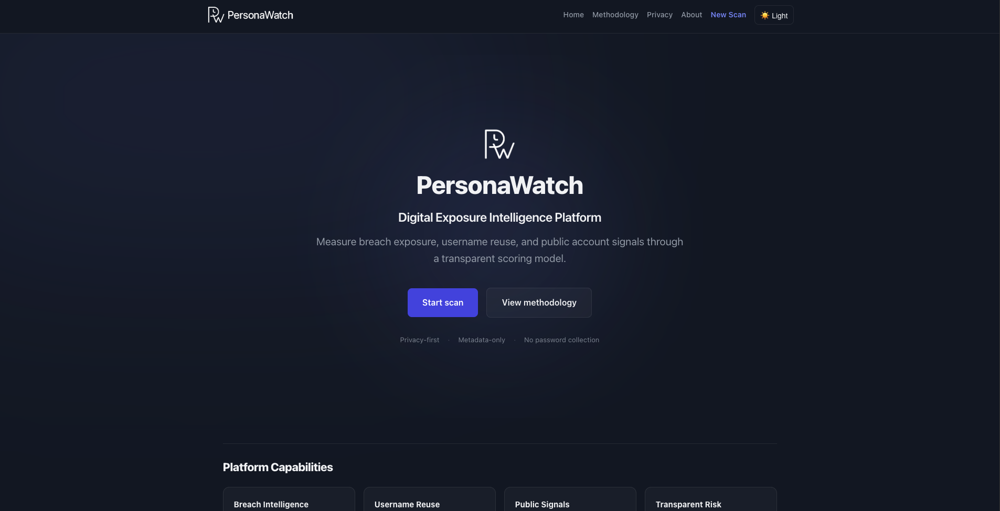
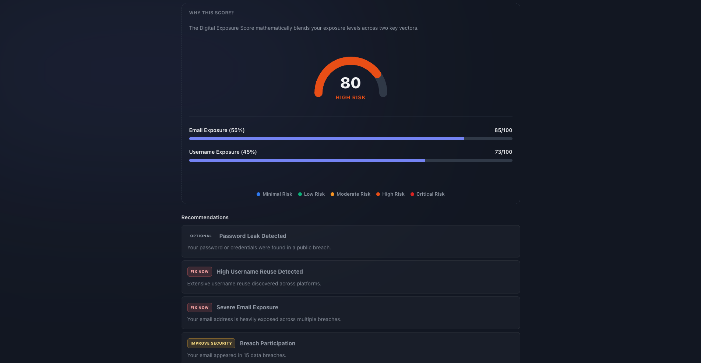
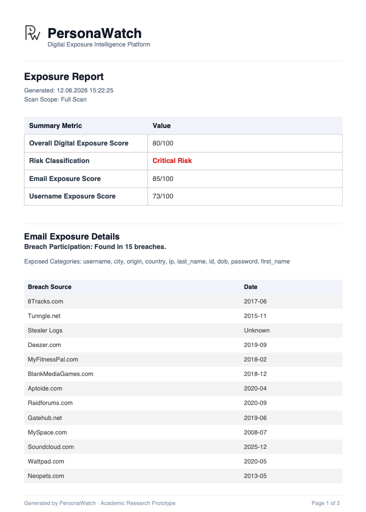

# PersonaWatch – Digital Exposure Intelligence Platform

A web application that assesses a user's digital exposure risk based on their email and username. It aggregates public data signals, breach history, and username reuse patterns to generate an overall exposure score and actionable security recommendations.

## Links

- **Live Demo:** https://digital-footprint-exposure-analyzer.vercel.app/
- **Backend API:** https://digital-footprint-api-mkl5.onrender.com/

## Project Overview

PersonaWatch analyzes public metadata to provide insight into a user's digital footprint. Built as an academic research prototype, it prioritizes strict privacy boundaries while aggregating historical breach intelligence and username reuse tracking.

## Architecture

```text
Frontend (React/Vite)
↓
Backend API (Express)
↓
External Breach & Public Signal Providers
↓
Exposure Scoring Engine
↓
PDF Reporting Layer
```

## Key Features

- **Metadata-only Analysis:** Evaluates exposure without ever collecting or displaying leaked passwords.
- **Dynamic Risk Scoring:** Uses distinct, weighted metrics for email and username risks.
- **Priority-Ranked Recommendations:** Generates contextual security advice based on explicit severity levels.
- **PDF Report Export:** Generates natively structured, paginated PDF reports without relying on browser print hacks.

## Screenshots

*Images are located in the `/docs` directory.*

- **Home Page**
  

- **Results Dashboard**
  

- **PDF Export Report**
  

## Scanning Modes

PersonaWatch provides modular scan modes to ensure users only query the data they need:
- **Full Scan:** Comprehensive analysis blending both email breach data and username reuse visibility.
- **Email Exposure Scan:** Focused analysis of known breach databases.
- **Username Exposure Scan:** Focused analysis checking username reuse across public platforms and verified endpoints.

## Example Workflow

1. Select the desired scan mode (Full Scan, Email Exposure Scan, or Username Exposure Scan).
2. Enter the target email address and/or username.
3. Review the generated Digital Exposure Score, Email Exposure Score, and/or Username Exposure Score.
4. Analyze the aggregated breach history, username variations, and platform matches.
5. Export the detailed PDF Export Report or copy the summary for offline review.

## Risk Scoring Methodology

Scores are calculated to formulate a final risk level using historical patterns and public signal presence:
- **Email Exposure Score:** Evaluates the severity and quantity of data breach involvement.
- **Username Exposure Score:** Evaluates platform presence, distinguishing between verified APIs and public heuristic signals.
- **Digital Exposure Score:** The overall score logic uses the formula `Digital Exposure Score = 0.55 × Email Exposure Score + 0.45 × Username Exposure Score` for full scans. (Partial scans use 100% of the active vector).

## Privacy & Ethical Boundaries

PersonaWatch is built on privacy-by-design principles:
- **No Password Collection:** We never ask for, retrieve, or display passwords.
- **No Scan History Storage:** Scans are processed entirely in memory; history is never saved.
- **No User Accounts:** There is no authentication or tracking of users running the scans.
- **Metadata-only Analysis:** Results are derived entirely from public APIs and indicators.
- **Academic Research Prototype:** Developed to understand public exposure visibility. Users must only scan identifiers they own or are authorized to check.

## Tech Stack

- **Frontend:** React (Vite), jsPDF (for exports), CSS Modules
- **Backend:** Node.js, Express
- **Deployment:** Vercel (Frontend), Render (Backend API)

## Local Development

1. Install dependencies for both the frontend and backend:
   ```bash
   cd frontend && npm install
   cd ../backend && npm install
   ```

2. Start the backend server:
   ```bash
   cd backend
   npm run dev
   ```

3. Start the frontend development server:
   ```bash
   cd frontend
   npm run dev
   ```

## Disclaimer

This report and platform are based on public exposure signals and historical breach intelligence. PersonaWatch does not prove definitive account ownership and should not be used for harassment, stalking, or unauthorized profiling.

## License / Academic Use

PersonaWatch is provided as an academic research prototype.
